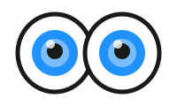

<!-- Improved compatibility of back to top link: See: https://github.com/othneildrew/Best-README-Template/pull/73 -->

<a id="readme-top"></a>

<!--
*** Thanks for checking out the Best-README-Template. If you have a suggestion
*** that would make this better, please fork the repo and create a pull request
*** or simply open an issue with the tag "enhancement".
*** Don't forget to give the project a star!
*** Thanks again! Now go create something AMAZING! :D
-->

<!-- PROJECT SHIELDS -->
<!--
*** I'm using markdown "reference style" links for readability.
*** Reference links are enclosed in brackets [ ] instead of parentheses ( ).
*** See the bottom of this document for the declaration of the reference variables
*** for contributors-url, forks-url, etc. This is an optional, concise syntax you may use.
*** https://www.markdownguide.org/basic-syntax/#reference-style-links
-->

[![Contributors][contributors-shield]][contributors-url]
[![Forks][forks-shield]][forks-url]
[![Stargazers][stars-shield]][stars-url]
[![Issues][issues-shield]][issues-url]

<!-- PROJECT LOGO -->
<br />
<div align="center">
   <a href="https://github.com/KushalM23/Dexter">
      
   </a>

<h3 align="center">DexE - Wildlife Binder</h3>

   <p align="center">
      DexE is a mobile-first wildlife identification and collection experience. Photograph real animals, get a species match, and unlock collectible cards that build a personal wildlife binder. Progression systems like challenges, streaks, and XP turn real-world exploration into a long-term collecting game.
      <br />
      <a href="https://github.com/KushalM23/Dexter#readme"><strong>Explore the docs »</strong></a>
      <br />
      <br />
      <a href="https://github.com/KushalM23/Dexter">View Demo</a>
      &middot;
      <a href="https://github.com/KushalM23/Dexter/issues/new?labels=bug">Report Bug</a>
      &middot;
      <a href="https://github.com/KushalM23/Dexter/issues/new?labels=enhancement">Request Feature</a>
   </p>
</div>

<!-- TABLE OF CONTENTS -->
<details>
   <summary>Table of Contents</summary>
   <ol>
      <li>
         <a href="#about-the-project">About The Project</a>
         <ul>
            <li><a href="#built-with">Built With</a></li>
         </ul>
      </li>
      <li>
         <a href="#getting-started">Getting Started</a>
         <ul>
            <li><a href="#prerequisites">Prerequisites</a></li>
            <li><a href="#installation">Installation</a></li>
         </ul>
      </li>
      <li><a href="#usage">Usage</a></li>
      <li><a href="#roadmap">Roadmap</a></li>
      <li><a href="#contributing">Contributing</a></li>
      <li><a href="#license">License</a></li>
      <li><a href="#contact">Contact</a></li>
      <li><a href="#acknowledgments">Acknowledgments</a></li>
   </ol>
</details>

<!-- ABOUT THE PROJECT -->

## About The Project


DexE blends three ideas into a single product: real-world discovery, collecting, and progression. Users capture a photo, the system enriches it with a likely species, and the app mints a card into the user's binder. Completing challenges and maintaining streaks unlocks XP and ranks on the leaderboard.

Core experience loop:

1. **Capture** - take or upload a photo of a wild species.
2. **Identify** - the backend infers a likely species and enriches metadata.
3. **Collect** - a new card is awarded with a rarity tier.
4. **Progress** - XP, streaks, and challenges drive continued play.

The UI is designed for mobile first but scales to desktop for browsing collections, profiles, and leaderboards.

<p align="right">(<a href="#readme-top">back to top</a>)</p>

### Built With

- [![Next][Next.js]][Next-url]
- [![React][React.js]][React-url]
- [![Supabase][Supabase.io]][Supabase-url]
- [![Tailwind][TailwindCSS.com]][Tailwind-url]
- [![Framer][Framer.com]][Framer-url]

<p align="right">(<a href="#readme-top">back to top</a>)</p>

<!-- GETTING STARTED -->

## Getting Started

Follow these steps to run DexE locally.

### Prerequisites

- Node.js 20+ and npm
  ```sh
  node -v
  npm -v
  ```

### Installation

1. Clone the repo
   ```sh
   git clone https://github.com/github_username/repo_name.git
   ```
2. Install NPM packages
   ```sh
   npm install
   ```
3. Create a `.env.local` in the repo root
   ```env
   NEXT_PUBLIC_SUPABASE_URL=...
   NEXT_PUBLIC_SUPABASE_ANON_KEY=...
   GEMINI_API_KEY=...
   ```
4. Run the development server
   ```sh
   npm run dev
   ```

<p align="right">(<a href="#readme-top">back to top</a>)</p>

<!-- USAGE EXAMPLES -->

## Usage

The app is organized around a capture flow and a collection experience:

- Capture a photo on the home flow.
- Review the identification result and unlock a card.
- Track progress in the profile, challenges, and leaderboard pages.

For product and UX details, see [ui_design_reference.md](ui_design_reference.md) and [prd.md](prd.md). For the species art pipeline, see [lora_pixel_art_guide.md](lora_pixel_art_guide.md).

<p align="right">(<a href="#readme-top">back to top</a>)</p>

<!-- ROADMAP -->

## Roadmap

- [ ] Add species image generation using LoRA models ([lora_pixel_art_guide.md](lora_pixel_art_guide.md))
- [ ] Add friends feature
- [ ] Add trading feature

See the [open issues](https://github.com/KushalM23/Dexter/issues) for a full list of proposed features (and known issues).

<p align="right">(<a href="#readme-top">back to top</a>)</p>

<!-- CONTRIBUTING -->

## Contributing

Contributions are what make the open source community such an amazing place to learn, inspire, and create. Any contributions you make are **greatly appreciated**.

If you have a suggestion that would make this better, please fork the repo and create a pull request. You can also simply open an issue with the tag "enhancement".
Don't forget to give the project a star! Thanks again!

1. Fork the Project
2. Create your Feature Branch (`git checkout -b feature/AmazingFeature`)
3. Commit your Changes (`git commit -m 'Add some AmazingFeature'`)
4. Push to the Branch (`git push origin feature/AmazingFeature`)
5. Open a Pull Request

<p align="right">(<a href="#readme-top">back to top</a>)</p>

<!-- LICENSE -->

## License

License information will be added here.

<p align="right">(<a href="#readme-top">back to top</a>)</p>

<!-- CONTACT -->

## Contact

Project Link: [https://github.com/KushalM23/Dexter](https://github.com/KushalM23/Dexter)

<p align="right">(<a href="#readme-top">back to top</a>)</p>

<!-- ACKNOWLEDGMENTS -->

## Acknowledgments

- GBIF
- iNaturalist
- Wikipedia

<p align="right">(<a href="#readme-top">back to top</a>)</p>

<!-- MARKDOWN LINKS & IMAGES -->
<!-- https://www.markdownguide.org/basic-syntax/#reference-style-links -->

[contributors-shield]: https://img.shields.io/github/contributors/KushalM23/Dexter.svg?style=for-the-badge
[contributors-url]: https://github.com/KushalM23/Dexter/graphs/contributors
[forks-shield]: https://img.shields.io/github/forks/KushalM23/Dexter.svg?style=for-the-badge
[forks-url]: https://github.com/KushalM23/Dexter/network/members
[stars-shield]: https://img.shields.io/github/stars/KushalM23/Dexter.svg?style=for-the-badge
[stars-url]: https://github.com/KushalM23/Dexter/stargazers
[issues-shield]: https://img.shields.io/github/issues/KushalM23/Dexter.svg?style=for-the-badge
[issues-url]: https://github.com/KushalM23/Dexter/issues

<!-- Shields.io badges. You can a comprehensive list with many more badges at: https://github.com/inttter/md-badges -->

[Next.js]: https://img.shields.io/badge/next.js-000000?style=for-the-badge&logo=nextdotjs&logoColor=white
[Next-url]: https://nextjs.org/
[React.js]: https://img.shields.io/badge/React-20232A?style=for-the-badge&logo=react&logoColor=61DAFB
[React-url]: https://reactjs.org/
[Supabase.io]: https://img.shields.io/badge/Supabase-3ECF8E?style=for-the-badge&logo=supabase&logoColor=white
[Supabase-url]: https://supabase.com/
[TailwindCSS.com]: https://img.shields.io/badge/Tailwind%20CSS-0F172A?style=for-the-badge&logo=tailwindcss&logoColor=38BDF8
[Tailwind-url]: https://tailwindcss.com/
[Framer.com]: https://img.shields.io/badge/Framer-0055FF?style=for-the-badge&logo=framer&logoColor=white
[Framer-url]: https://www.framer.com/motion/
